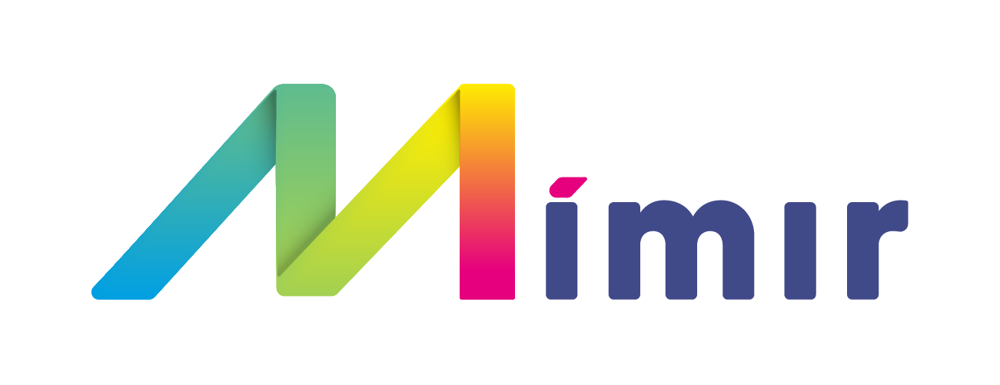

<div align="center">

  
  <h1>Mimir</h1>
  
  <p>
    A tool for building semantically supported facility data!
  </p>

  
<!-- Badges -->
<p>
<a href="https://github.com/mimir-org/mimir/actions/workflows/prod.yaml">
    
  </a>

  <a href="https://github.com/mimir-org/mimir/graphs/contributors">
    
  </a>
  
  <a href="https://github.com/mimir-org/mimir/commits/main">
    
  </a>

  <a href="https://github.com/mimir-org/mimir/issues/">
    
  </a>

  <a href="https://github.com/mimir-org/mimir/blob/master/LICENSE">
    
  </a>

  <a href="https://github.com/mimir-org/mimir/releases">
  
  </a>

  <a href="https://hub.docker.com/repository/docker/mimirorg/mimir-client">
  
  </a>

  <a href="https://hub.docker.com/repository/docker/mimirorg/mimir-client">
  
  </a>
</p>

  <h4>
    <a href="https://github.com/mimir-org/mimir/issues">Report a bug or register a feature</a>
  </h4>
</div>

<br />

<!-- Table of Contents -->
# :notebook_with_decorative_cover: Table of Contents

- [About the Project](#star2-about-the-project)
  * [Tech Stack](#space_invader-tech-stack)
  * [Environment Variables](#key-environment-variables)
- [Getting Started](#toolbox-getting-started)
  * [Prerequisites](#bangbang-prerequisites)
  * [Running Locally](#running-running)
- [Contributing](#wave-contributing)
  * [Code of Conduct](#scroll-code-of-conduct)
- [License](#warning-license)
- [Contact](#handshake-contact)

<!-- About the Project -->
## :star2: About the Project

<!-- TechStack -->
### :space_invader: Tech Stack

<details>
  <summary>Client</summary>
  <ul>
    <li><a href="https://www.typescriptlang.org/">Typescript</a></li>
    <li><a href="https://reactjs.org/">React.js</a></li>
    <li><a href="https://reactrouterdotcom.fly.dev/">React Router</a></li>
    <li><a href="https://react-hook-form.com/">React Redux</a></li>
    <li><a href="https://styled-components.com/">styled-components</a></li>
    <li><a href="https://reactflow.dev/">React Flow</a></li>
    <li><a href="https://styled-icons.dev/">styled-icons</a></li>
    <li><a href="https://threejs.org/">three.js</a></li>
  </ul>
</details>

<details>
  <summary>Server</summary>
  <ul>
    <li><a href="https://dotnet.microsoft.com/en-us/languages/csharp">C#</a></li>
    <li><a href="https://docs.microsoft.com/en-us/aspnet/core/">ASP.NET</a></li>
    <li><a href="https://www.newtonsoft.com/json">Json.NET</a></li>    
    <li><a href="https://docs.microsoft.com/en-us/ef/">Entity Framework</a></li>
    <li><a href="https://automapper.org/">AutoMapper</a></li>
    <li><a href="https://xunit.net/">xUnit.NET</a></li>  
    <li><a href="https://github.com/domaindrivendev/Swashbuckle.AspNetCore">Swashbuckle</a></li>    
    <li><a href="https://github.com/moq/moq4">Moq</a></li>
    <li><a href="https://github.com/pankleks/TypeScriptBuilder">TypeScriptBuilder</a></li>
    <li><a href="https://dotnetrdf.org/">dotNetRDF</a></li>
  </ul>
</details>

<details>
<summary>Database</summary>
  <ul>
    <li><a href="https://www.microsoft.com/en-us/sql-server/">MSSQL</a></li>
  </ul>
</details>

<details>
<summary>DevOps</summary>
  <ul>
    <li><a href="https://www.docker.com/">Docker</a></li>
    <li><a href="https://www.nuget.org/">NuGet</a></li>
    <li><a href="https://github.com/features/actions">Github Actions</a></li>
    <li><a href="https://www.npmjs.com/">NPM</a></li>
  </ul>
</details>

<!-- Env Variables -->
### :key: Environment Variables

<!-- Client environment variables -->
<details>
<summary>Client</summary>

To set environment variables for client in development, edit the .env file. For production build, you have to set the environment variables into the container itself. You can override the .env with a .env.local file. This file is not included in git repo.

`REACT_APP_API_BASE_URL` - Url to backend server

`REACT_APP_SOCKET_BASE_URL` - Url to backend server used with websocket connection

`REACT_APP_APP_ID` - Application id of server app registration in Azure AD

`REACT_APP_CLIENT_ID` - Application id of client app registration in Azure AD

`REACT_APP_TENANT_ID` - Azure tenant

`REACT_APP_COMPANY` - Company domain (should be removed)

`REACT_APP_MIMIR_VERSION` - The Mimir version number

`REACT_APP_APP_INSIGHTS_CONNECTION_STRING` - Application insight connection string

If you are running the server locally then the values will most likely be  
```js
// where x and y = api version
REACT_APP_API_BASE_URL = http://localhost:5001/v{x}.{y}/
REACT_APP_SOCKET_BASE_URL = http://localhost:5001/
REACT_APP_APP_ID = xxxxxxxx-xxxx-xxxx-xxxx-xxxxxxxxxxxx
REACT_APP_CLIENT_ID = xxxxxxxx-xxxx-xxxx-xxxx-xxxxxxxxxxxx
REACT_APP_TENANT_ID = xxxxxxxx-xxxx-xxxx-xxxx-xxxxxxxxxxxx
REACT_APP_COMPANY = company.com
REACT_APP_MIMIR_VERSION = 2.0
REACT_APP_APP_INSIGHTS_CONNECTION_STRING = InstrumentationKey=xxxxxxxx-xxxx-xxxx-xxxx-xxxxxxxxxxxx;...
```
</details>

<!-- Server environment variables -->
<details>
<summary>Server</summary>

To set environment variables for server in development, edit the appsettings.json file. For production build, you have to set the environment variables into the application container itself. You can override the appsettings.json with a appsettings.local.json file. This file is not included in git repo.

`ASPNETCORE_ENVIRONMENT` - Set .NET core environment

`ApplicationSetting__CollaborationPartner__Name` - Name of default collaboration partner ex. Mimirorg

`ApplicationSetting__CollaborationPartner__Domain` - Domain of default collaboration partner ex. mimirorg.com

`ApplicationSetting__CollaborationPartner__Iris__0` - RDF domain of collaboration partner, e.g. rdf.mimirorg.com

`ApplicationSetting__TypeLibraryRootUri` - The root uri to Type Library

`ApplicationSetting__TypeLibraryVersion` - The version used by Type Library

`ApplicationSetting__TypeLibrarySecret` - he secret registered in Type Library. Used to identify and registered hooks

`AzureActiveDirectoryConfiguration__TenantId` - Azure tenant

`AzureActiveDirectoryConfiguration__ClientId` - Application id of Server application in Azure AD (app registration)

`CorsConfiguration__ValidOrigins` - Comma separated string of valid origins for CORS. E.g. http://localhost:3000,https://mimirorg.com

`DatabaseConfiguration__DataSource` - Identifier for database server

`DatabaseConfiguration__Port` - Port of database server. E.g. 1443

`DatabaseConfiguration__InitialCatalog` - Database name

`DatabaseConfiguration__DbUser` - Server application database username, must be db owner on given catalog

`DatabaseConfiguration__Password` - Server application database password

</details>

<!-- Getting Started -->
## 	:toolbox: Getting Started

<!-- Prerequisites -->
### :bangbang: Prerequisites

This project uses .NET 6 for the server and NPM as package manager for the client,
make sure that you have these installed before continuing.
Mimir has dependency on Type Library Service. Clone that project as well if not running on external server (```git clone git@github.com:mimir-org/typelibrary.git```).
You also need a MSSQL database running on your machine. See docker-compose for running sql in docker.

Start by cloning the project
```git 
git clone git@github.com:mimir-org/mimir.git
```

Navigate to the new directory
```bash
cd ./mimir
```

<!-- Running Locally -->
### :running: Running Locally
|                         | Client      | Server      |
| ----------------------- | ----------- | ----------- |
| :gear: Installation     | ```cd src/client``` <br /> ```npm install```   | ```cd src/server``` <br /> ```dotnet build```      |
| :running: Run Locally   | ```cd src/client``` <br /> ```npm start``` | ```cd src/server/ModelBuilder.Api``` <br /> ```dotnet run```      |

#### Docker

```bash
cd ./mimir
docker-compose up -d
```

<!-- Contributing -->
## :wave: Contributing
We welcome community pull requests for bug fixes, enhancements, and documentation. See [How to contribute](./Contribute.md) for more information.

<!-- Code of Conduct -->
### :scroll: Code of Conduct
This project has adopted the code of conduct defined by the Contributor Covenant to clarify expected behavior in our community. For more information, see the [.NET Foundation Code of Conduct](https://dotnetfoundation.org/about/code-of-conduct).


<!-- License -->
## :warning: License

Distributed under the MIT License. See [LICENSE](./LICENSE) for more information.

<!-- Contact -->
## :handshake: Contact

Mimir-org - orgmimir@gmail.com

Project Link: [https://github.com/mimir-org/mimir](https://github.com/mimir-org/mimir)

